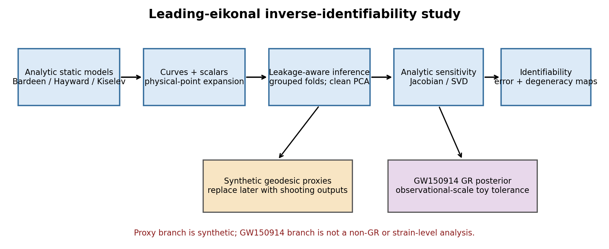
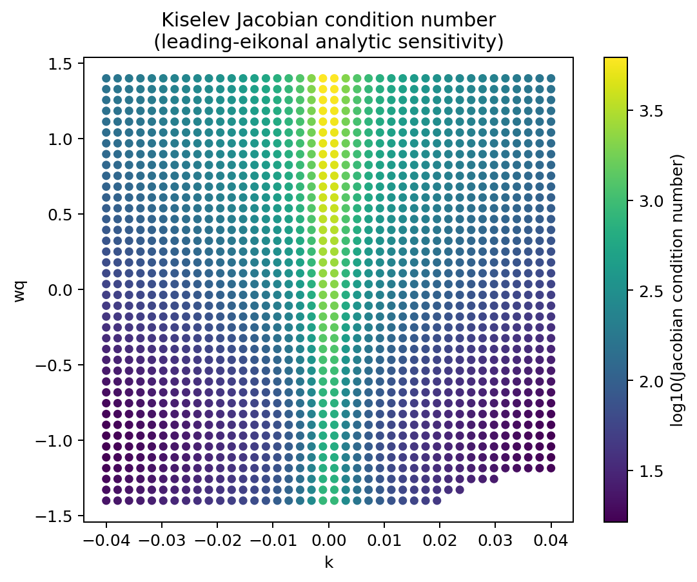
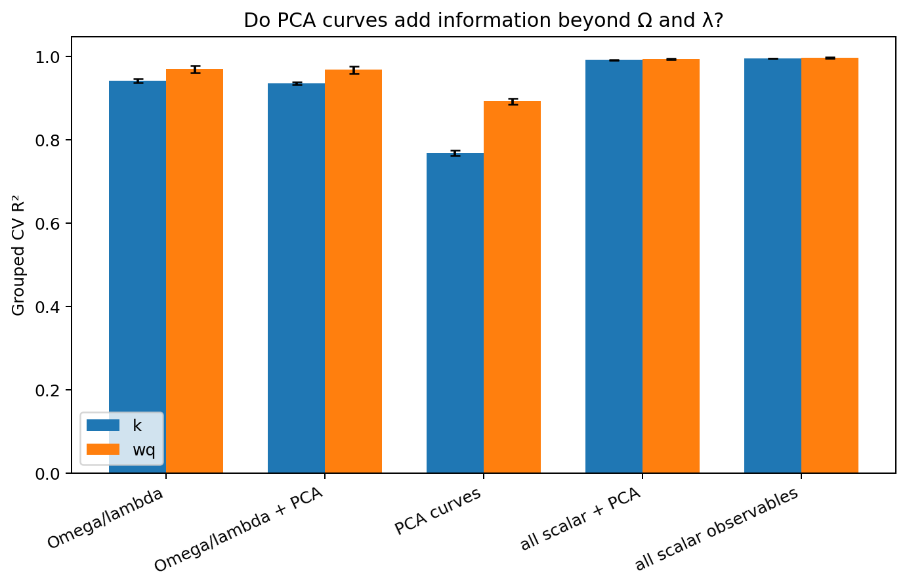
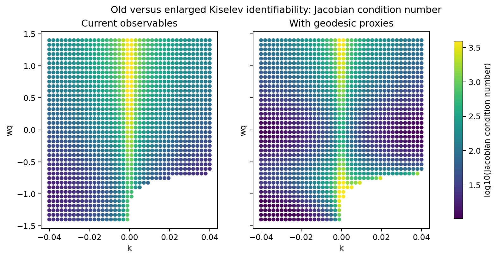
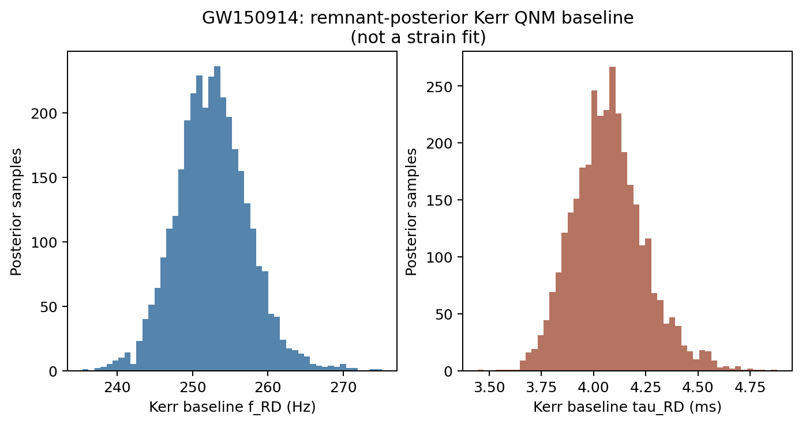
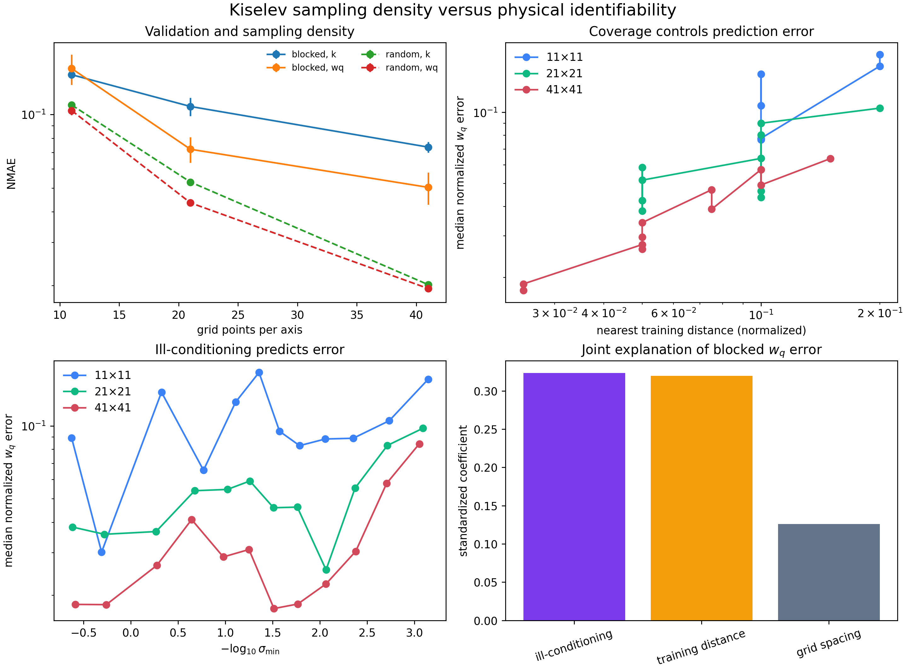
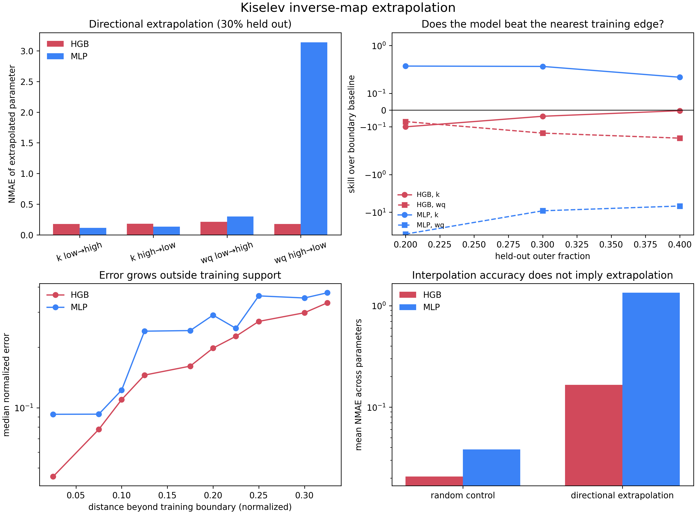

# Machine-learning inference of black-hole hair from leading-eikonal observables

> A leakage-aware AI-for-science pipeline for studying inverse black-hole-hair identifiability from ringdown, geodesic observables, analytic sensitivity, and public GW posterior scales.




*Analytic black-hole models are evaluated with leakage-aware grouped validation and Jacobian sensitivity. The geodesic branch currently uses synthetic proxies; GW150914 supplies only a posterior-scale comparison.*

## Main scientific takeaway

The main result is that black-hole-hair inference is an identifiability problem, not merely an ML prediction problem. Dense grouped validation shows that Kiselev parameters are recoverable by interpolation within the assumed analytic model family, but analytic sensitivity reveals a local degeneracy near \(k \approx 0\), where \(w_q\) becomes weakly identifiable. Synthetic independent geodesic observables reduce this near-degenerate error, suggesting that real ray-traced observables such as screen position, propagation time, and redshift may be the next useful step.

## What this project does

- Generates synthetic leading-eikonal observables for Schwarzschild, Bardeen, Hayward, and Kiselev spacetimes.
- Compresses illustrative ringdown curves using PCA.
- Trains inverse regressors, a forward surrogate, and model-family classifiers.
- Uses grouped physical splits to prevent repeated \((\ell,n)\) observations from leaking across train and test.
- Computes numerical Jacobians, singular values, and condition maps for local identifiability.
- Tests replaceable synthetic independent geodesic-observable proxies.
- Optionally propagates public GW150914 posterior samples through a Kerr QNM baseline.

## What this project does **not** do

- It does **not** detect black-hole hair.
- It does **not** fit raw gravitational-wave strain.
- It is **not** a full gravitational QNM solver.
- The geodesic extension uses synthetic proxies unless a real shooting CSV is supplied.
- The GW150914 branch propagates a GR posterior; it is not a modified-gravity constraint or non-GR likelihood.

## Key results

| Study | Result |
|---|---|
| Dense Kiselev grouped CV | \(R^2(k)=0.992\pm0.001\), \(R^2(w_q)=0.994\pm0.002\) |
| Analytic sensitivity | Local ill-conditioning is strongest near the zero-hair limit \(k\approx0\) |
| Synthetic geodesic proxies | Mean absolute \(w_q\) error decreases from 0.0225 to 0.0143 |
| Enlarged Jacobian near \(k=0\) | Median minimum singular value improves by about 12×; condition number by about 2.13× |
| GW150914 scale check | \(f_\mathrm{RD}=252.52\) Hz and \(\tau_\mathrm{RD}=4.065\) ms posterior medians |

### Dense Kiselev identifiability



*Dense grouped validation shows that the Kiselev inverse problem is globally learnable, but the Jacobian becomes ill-conditioned near the zero-hair limit \(k\approx0\).*

### Feature realism



*PCA waveform coefficients do not add independent physics information because the illustrative waveform is deterministic in \(\Omega\), \(\lambda\), \(\ell\), and \(n\); the independent scalar \(\delta r\) is more informative.*

### Synthetic geodesic-proxy extension



*Adding synthetic geodesic-observable proxies improves conditioning for small nonzero \(k\), but the exact \(k=0\) rank loss remains fundamental. These are not physical ray-tracing results.*

### Public-event posterior scale



*GW150914 is used only as a posterior-scale comparison, not as a non-GR strain-level analysis or a hair detection.*

## Quick start

Python 3.10 or newer is recommended.

```bash
python -m pip install -e .
python -m bhhairml.workflows.reproduce_ai4s2026 --config configs/ai4s2026.yaml
```

The second command is the paper workflow: it regenerates the identifiability,
geodesic-proxy, and waveform experiments in a new timestamped
`artifacts/ai4s2026/` directory, validates every headline number against
`paper/ai4s2026/claims.json`, prepares the paper workspace, and compiles it
when `pdflatex` and `bibtex` are available. Existing report outputs are not
overwritten.

Individual experiment entry points remain available:

```bash
python -m bhhairml.experiments.run_all_experiments
python -m bhhairml.experiments.scientific_audit
python -m bhhairml.experiments.geodesic_extension \
  --identifiability-config configs/third_pass_identifiability.yaml \
  --geodesic-config configs/geodesic_observables.yaml
```

The first identifiability-paper milestone uses genuinely contiguous
parameter-space blocks and a Jacobian standardized only with training-domain
scales:

```bash
python -m bhhairml.experiments.identifiability_milestone
```

It writes validation tables, out-of-fold predictions, the standardized
Jacobian grid, and a composite Kiselev diagnostic to
`artifacts/identifiability_milestone/`.

The next controlled experiment separates sparse sampling from physical
ill-conditioning using matched random and spatially blocked cross-validation
on nested coarse, medium, and dense Kiselev grids:

```bash
python -m bhhairml.experiments.sampling_density_study
```

It records the nearest-training-point distance for every out-of-fold
prediction and fits a descriptive joint error model using conditioning,
training coverage, and grid spacing.



See the [sampling-density study report](reports/sampling_density_study.md) for
the matched validation results and interpretation.

Directional extrapolation is evaluated separately with a histogram-boosted
tree ensemble and a scaled MLP:

```bash
python -m bhhairml.experiments.extrapolation_study
```

The experiment holds out the upper or lower 20%, 30%, and 40% of each Kiselev
parameter axis and compares performance with a size-matched random control and
the nearest-training-boundary baseline.



See the [directional extrapolation report](reports/extrapolation_study.md) for
the protocol, numerical results, and limitations.

Windows PowerShell:

```powershell
python -m bhhairml.experiments.geodesic_extension `
  --identifiability-config configs/third_pass_identifiability.yaml `
  --geodesic-config configs/geodesic_observables.yaml
```

### Optional real-data demo

```bash
python -m bhhairml.realdata.run_realdata_demo --event GW150914 --config configs/realdata_config.yaml
```

This command may download public GWOSC/LVK posterior data. Large posterior files are cached under `data/real/gwosc/` and intentionally ignored by Git.

## Repository structure

| Path | Purpose |
|---|---|
| `src/bhhairml/physics/` | Static analytic models, QNM mapping, and waveform generation |
| `src/bhhairml/features/` | Leakage-safe PCA and feature construction |
| `src/bhhairml/models/` | Forward, inverse, and classification estimators |
| `src/bhhairml/experiments/` | Static MVP, grouped audits, identifiability, and proxy studies |
| `src/bhhairml/geodesic_observables/` | Synthetic proxies and real shooting-CSV interface |
| `src/bhhairml/realdata/` | GWOSC download, posterior parsing, Kerr baseline, and toy tolerances |
| `configs/` | Reproducible dataset and experiment settings |
| `reports/` | Selected manuscript and poster outputs |
| `docs/images/` | Curated web-friendly figures used in this README |

## Poster-ready outputs

- [Poster abstract](docs/poster_abstract.md)
- [Project summary](docs/project_summary.md)
- [Detailed poster text](reports/poster_summary.md)
- [Preliminary manuscript](reports/manuscript.pdf)

### Poster-grade physics figures

```bash
python -m bhhairml.plots.poster_physics_figures
```

This creates paired PNG/PDF illustrations in
`reports/figures/Illustrations/` and web-ready PNG copies in
[`docs/images/Illustrations/`](docs/images/Illustrations/). The ray paths are
analytic static-metric illustrations, and the geodesic improvement uses
synthetic proxies—not full physical ray tracing or detector-level inference.

Poster-ready research prototype. **Not yet a journal-ready observational analysis.**

## Limitations

- Leading-eikonal/geodesic approximation only.
- Synthetic analytic formulas, not detector-level inference.
- Geodesic observables are proxies unless a validated shooting CSV is supplied.
- The GW150914 branch propagates a GR posterior and does not fit strain.
- The current Kerr fallback is an approximate dominant-mode fitting formula when `qnm` is unavailable.
- No claim of modified-gravity constraints, exclusions, or hair detection is made.

See [the detailed limitations](docs/limitations.md).

## How to cite

If you use this research prototype, please cite the repository through [`CITATION.cff`](CITATION.cff) and the associated black-hole ringdown work. No DOI has been assigned.

## Related physics work

This repository builds on the leading-eikonal QNM/geodesic framework used in *Ringdown waves from hairy black holes* by Ariadna Uxue Palomino Ylla et al.

[arXiv link / journal link to be added]

## License

Released under the [MIT License](LICENSE).
