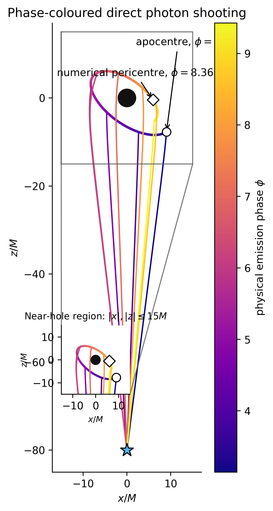

# Physical identifiability and inverse learning of black-hole hair

> A theoretical benchmark combining timelike-emitter evolution, three-dimensional null-geodesic shooting, physical observables, Jacobian identifiability, and leakage-aware inverse learning.


*The mature workflow evaluates a 121-point physical Kiselev grid using validated direct photon shooting, local and finite-domain identifiability diagnostics, registered random/grouped/directional splits, traditional inverse baselines, and 161/321-phase robustness audits. Historical proxy experiments remain available but are not substituted for the physical results.*

## Physical geodesic shooting



The shooting solver starts a timelike emitter at apocentre, $\phi=\pi$, on an
$r_p=8M$, $r_a=12M$ orbit and adjusts each direct-branch photon launch direction
until it reaches the observer at $(0,0,-80M)$. The representative image uses
$M=1$, $k=10^{-3}$, and $w_q=-0.5$; every plotted path is re-integrated from an
archived converged launch angle. See the
[physical visualization validation report](reports/shooting_visualization_validation.md)
for constraint and hit-error checks. This is a controlled theoretical benchmark,
not an observational image of a real black hole or a ray-traced accretion flow.
The shooting algorithm adjusts two initial photon angles at each emitter phase
until the direct null geodesic reaches the observer. These trajectories generate
the physical photon-geometry, redshift, and timing observables used in the
identifiability analysis.

## Main scientific takeaway

The main result is that black-hole-hair inference is an identifiability problem, not merely an ML prediction problem. The exact \(k=0\) boundary is structurally rank deficient because \(w_q\) disappears from the metric. Away from that boundary, physical photon geometry complements ringdown: adding it improves the grid-median minimum singular value by **4.54×** and the median condition number by **2.28×**.

A training-only nearest-physical-model baseline confirms that this benefit is not specific to a learned architecture. Adding photon geometry improves identifiable-\(w_q\) NMAE by **30.1%** under random interpolation, **32.9%** under grouped interpolation, and **23.3%** under directional extrapolation. Forward-feature convergence does not, however, guarantee inverse-estimator robustness; frozen-estimator tail shifts remain a separate diagnostic.

Across the sampled 121-point physical grid, no unresolved distant finite-$k$
observable collisions are found at the tested numerical resolution; this does
not constitute a proof of continuous global injectivity. Photon geometry
reduces distant sampled ambiguities while rearranging some local neighbor
orderings.

## What this project does

- Generates synthetic leading-eikonal observables for Schwarzschild, Bardeen, Hayward, and Kiselev spacetimes.
- Compresses illustrative ringdown curves using PCA.
- Trains inverse regressors, a forward surrogate, and model-family classifiers.
- Uses grouped physical splits to prevent repeated \((\ell,n)\) observations from leaking across train and test.
- Computes numerical Jacobians, singular values, and condition maps for local identifiability.
- Integrates timelike emitter orbits and shoots direct null geodesics in Cartesian coordinates to a static observer.
- Extracts photon geometry, redshift, propagation-delay, and arrival-time observables with explicit failure accounting.
- Evaluates registered random, grouped, and directional inverse-learning protocols with training-only preprocessing.
- Compares learned estimators with nearest-physical-model and local-Jacobian inverse baselines.
- Audits exact rank loss, finite-domain observable collisions, and 81/161/321-phase numerical robustness.
- Optionally propagates public GW150914 posterior samples through a Kerr QNM baseline.

## What this project does **not** do

- It does **not** detect black-hole hair.
- It does **not** fit raw gravitational-wave strain.
- It is **not** a full gravitational QNM solver.
- It is a theoretical identifiability benchmark, not an observational constraint on black-hole hair.
- Direct-branch photon shooting is not a complete imaging or detector-likelihood pipeline.
- The GW150914 branch propagates a GR posterior; it is not a modified-gravity constraint or non-GR likelihood.

## Key results

| Study | Result |
|---|---|
| Dense Kiselev grouped CV | \(R^2(k)=0.992\pm0.001\), \(R^2(w_q)=0.994\pm0.002\) |
| Analytic sensitivity | Local ill-conditioning is strongest near the zero-hair limit \(k\approx0\) |
| Physical observable complementarity | Grid-median \(\sigma_{\min}\) improves 4.54×; median condition number improves 2.28× |
| Nearest-physical-model baseline | Identifiable-\(w_q\) NMAE improves 30.1% random, 32.9% grouped, and 23.3% directional |
| Numerical audits | Uniform 161-phase grid: 121/121 complete; targeted 321-phase audit: 35/35 complete |
| Finite-domain audit | No unresolved distant finite-\(k\) collision found on the sampled grid at the tested resolution |
| GW150914 scale check | \(f_\mathrm{RD}=252.52\) Hz and \(\tau_\mathrm{RD}=4.065\) ms posterior medians |

### Dense Kiselev identifiability


*Dense grouped validation shows learnability on the sampled synthetic benchmark, but the Jacobian becomes ill-conditioned near the zero-hair limit \(k\approx0\).*

### Feature realism


*PCA waveform coefficients do not add independent physics information because the illustrative waveform is deterministic in \(\Omega\), \(\lambda\), \(\ell\), and \(n\); the independent scalar \(\delta r\) is more informative.*

### Synthetic geodesic-proxy extension


*Adding synthetic geodesic-observable proxies improves conditioning for small nonzero \(k\), but the exact \(k=0\) rank loss remains fundamental. These are not physical ray-tracing results.*

### Public-event posterior scale


*GW150914 is used only as a posterior-scale comparison, not as a non-GR strain-level analysis or a hair detection.*

## Quick start

Python 3.10 or newer is recommended.

```bash
python -m pip install -e .
python -m bhhairml.workflows.reproduce_ai4s2026 --config configs/ai4s2026.yaml
```

The second command is the paper workflow: it regenerates the identifiability,
geodesic-proxy, and waveform experiments in a new timestamped
`artifacts/ai4s2026/` directory, validates every headline number against
`paper/ai4s2026/claims.json`, prepares the paper workspace, and compiles it
when `pdflatex` and `bibtex` are available. Existing report outputs are not
overwritten.

Individual experiment entry points remain available:

```bash
python -m bhhairml.experiments.run_all_experiments
python -m bhhairml.experiments.scientific_audit
python -m bhhairml.experiments.geodesic_extension \
  --identifiability-config configs/third_pass_identifiability.yaml \
  --geodesic-config configs/geodesic_observables.yaml
```

The first identifiability-paper milestone uses genuinely contiguous
parameter-space blocks and a Jacobian standardized only with training-domain
scales:

```bash
python -m bhhairml.experiments.identifiability_milestone
```

It writes validation tables, out-of-fold predictions, the standardized
Jacobian grid, and a composite Kiselev diagnostic to
`artifacts/identifiability_milestone/`.

The next controlled experiment separates sparse sampling from physical
ill-conditioning using matched random and spatially blocked cross-validation
on nested coarse, medium, and dense Kiselev grids:

```bash
python -m bhhairml.experiments.sampling_density_study
```

It records the nearest-training-point distance for every out-of-fold
prediction and fits a descriptive joint error model using conditioning,
training coverage, and grid spacing.


See the [sampling-density study report](reports/sampling_density_study.md) for
the matched validation results and interpretation.

Directional extrapolation is evaluated separately with a histogram-boosted
tree ensemble and a scaled MLP:

```bash
python -m bhhairml.experiments.extrapolation_study
```

The experiment holds out the upper or lower 20%, 30%, and 40% of each Kiselev
parameter axis and compares performance with a size-matched random control and
the nearest-training-boundary baseline.


See the [directional extrapolation report](reports/extrapolation_study.md) for
the protocol, numerical results, and limitations.

Observable complementarity near the exact `k=0` degeneracy is tested with
matched spatial-block folds:

```bash
python -m bhhairml.experiments.observable_complementarity
```


See the [observable-complementarity report](reports/observable_complementarity.md)
for the feature ranking and the exact structural rank-loss result.

Windows PowerShell:

```powershell
python -m bhhairml.experiments.geodesic_extension `
  --identifiability-config configs/third_pass_identifiability.yaml `
  --geodesic-config configs/geodesic_observables.yaml
```

### Optional real-data demo

```bash
python -m bhhairml.realdata.run_realdata_demo --event GW150914 --config configs/realdata_config.yaml
```

This command may download public GWOSC/LVK posterior data. Large posterior files are cached under `data/real/gwosc/` and intentionally ignored by Git.

## Repository structure

| Path | Purpose |
|---|---|
| `src/bhhairml/physics/` | Static analytic models, QNM mapping, and waveform generation |
| `src/bhhairml/features/` | Leakage-safe PCA and feature construction |
| `src/bhhairml/models/` | Forward, inverse, and classification estimators |
| `src/bhhairml/experiments/` | Static MVP, grouped audits, identifiability, and proxy studies |
| `src/bhhairml/shooting/` | Timelike-emitter and Cartesian null-geodesic integration |
| `src/bhhairml/geodesic_observables/` | Backward-compatible proxy and physical shooting-CSV interfaces |
| `src/bhhairml/validation/` | Physical-grid, robustness, independent-check, and ambiguity audits |
| `experiments/traditional_inverse_baselines/` | Nearest-model and local-Jacobian inverse baselines |
| `audits/` | Independent physical-shooting reference implementation and walkthrough |
| `src/bhhairml/realdata/` | GWOSC download, posterior parsing, Kerr baseline, and toy tolerances |
| `configs/` | Reproducible dataset and experiment settings |
| `reports/` | Selected manuscript and poster outputs |
| `docs/images/` | Curated web-friendly figures used in this README |

## Poster-ready outputs

- [Poster abstract](docs/poster_abstract.md)
- [Project summary](docs/project_summary.md)
- [Detailed poster text](reports/poster_summary.md)
- [Preliminary manuscript](reports/manuscript.pdf)

### Poster-grade physics figures

```bash
python -m bhhairml.plots.poster_physics_figures
```

This creates paired PNG/PDF illustrations in
`reports/figures/Illustrations/` and web-ready PNG copies in
[`docs/images/Illustrations/`](docs/images/Illustrations/). The ray paths are
analytic static-metric illustrations, and the geodesic improvement uses
synthetic proxies—not full physical ray tracing or detector-level inference.

Research-grade theoretical identifiability benchmark. **Not an observational analysis or constraint on black-hole hair.**

## Limitations

- Leading-eikonal/geodesic approximation only.
- Synthetic analytic formulas, not detector-level inference.
- The physical study uses the validated direct shooting branch; secondary photon branches and detector response are not modeled.
- The GW150914 branch propagates a GR posterior and does not fit strain.
- The current Kerr fallback is an approximate dominant-mode fitting formula when `qnm` is unavailable.
- No claim of modified-gravity constraints, exclusions, or hair detection is made.

See [the detailed limitations](docs/limitations.md).

## How to cite

If you use this research prototype, please cite the repository through [`CITATION.cff`](CITATION.cff) and the associated black-hole ringdown work. No DOI has been assigned.

## Related physics work

This repository builds on the leading-eikonal QNM/geodesic framework used in *Ringdown waves from hairy black holes* by Ariadna Uxue Palomino Ylla et al.

[Journal of Cosmology and Astroparticle Physics 2026(09), 046 (2026)](https://doi.org/10.1088/1475-7516/2026/09/046).

## License

Released under the [MIT License](LICENSE).
