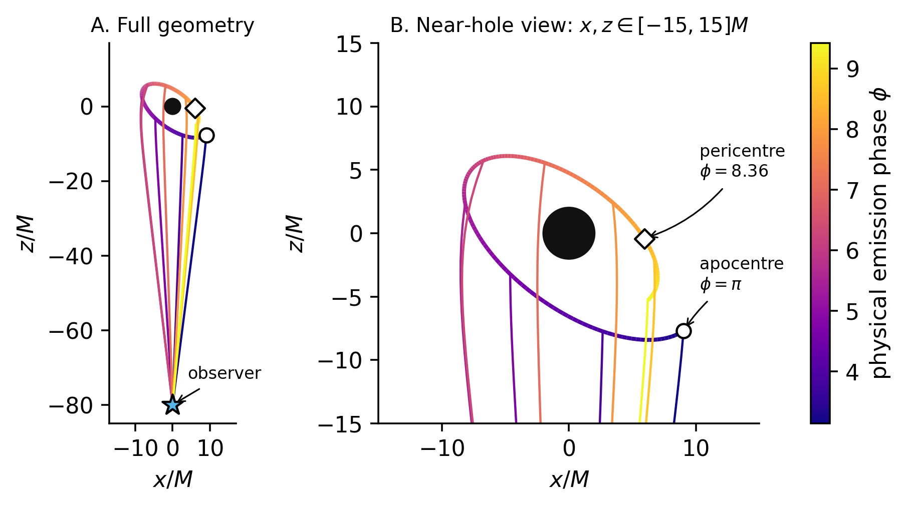
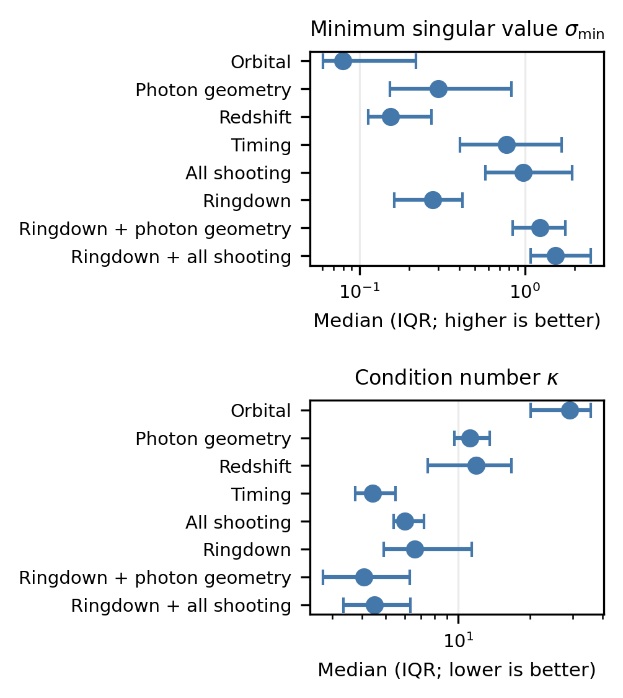
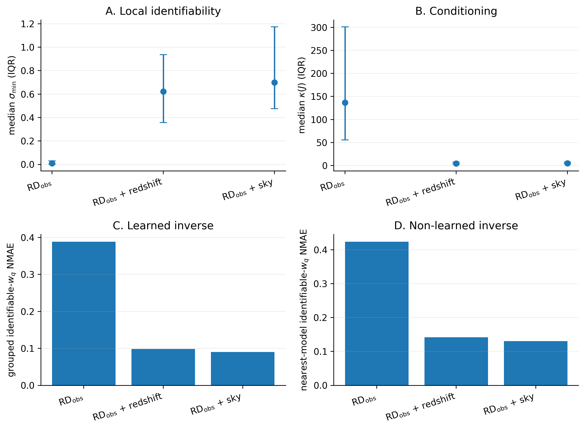
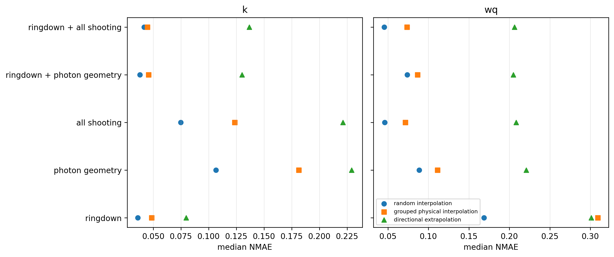
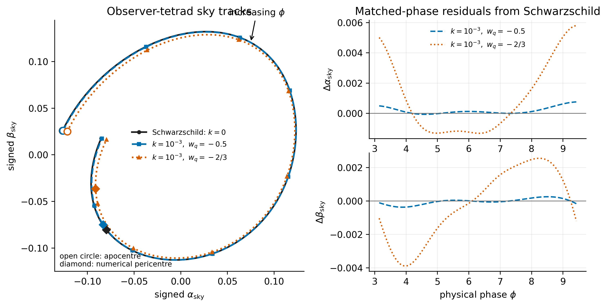

# Learning When Black Hole Hair Is Observable

> Physical identifiability, generalization, and observable complementarity in a controlled Kiselev black hole inverse problem.


This repository supports the manuscript **“Learning When Black Hole Hair Is Observable: Physical Identifiability, Generalization, and Observable Complementarity.”**

The study asks a simple question: when a black hole model has more than one physical parameter, do the observables actually contain enough independent information to distinguish them? The benchmark combines a validated timelike emitter, three-dimensional direct null-geodesic shooting, Jacobian identifiability diagnostics, leakage-aware inverse learning, non-learned baselines, and numerical-resolution audits.

**This is a theoretical identifiability benchmark, not an observational constraint on black hole hair.**

[Read the current manuscript](paper/current_study/manuscript/manuscript.pdf)

---

## Physical setup



For each point on an 11×11 Kiselev grid, the pipeline evolves one timelike emitter with $r_p=8M$ and $r_a=12M$, then solves the two launch angles of the direct photon branch so that the null ray reaches a static observer at $(0,0,-80M)$.

At each successful phase the calculation records redshift, impact parameter, signed observer-sky coordinates, and timing quantities. The nominal physical archive uses 81 phase samples; 161- and targeted 321-phase calculations are used as numerical audits.

The Kiselev metric is

$$
f(r)=1-\frac{2M}{r}-\frac{k}{r^{1+3w_q}}.
$$

Here $k$ controls deformation strength and $w_q$ controls its radial dependence.

At $k=0$, the deformation disappears and the spacetime is Schwarzschild for every nominal $w_q$. That exact structural degeneracy provides a known null control for the identifiability analysis.

---

## Observable complementarity



The main physical result is that **large response is not the same as identifiability**.

Ringdown alone leaves a weak parameter direction. Adding independent observables rotates and strengthens the response geometry:

| Feature set | median $\sigma_{\min}$ | median $\kappa(J)$ | grouped identifiable-$w_q$ NMAE | directional identifiable-$w_q$ NMAE |
|---|---:|---:|---:|---:|
| Ringdown | 0.2782 | 6.6112 | 0.3093 | 0.3011 |
| Ringdown + redshift | 0.9459 | 3.6107 | 0.0991 | 0.1922 |
| Ringdown + photon geometry | 1.2326 | 4.0731 | 0.0865 | 0.2048 |

Relative to ringdown alone, ringdown + photon geometry gives a median pointwise **4.54×** gain in minimum singular value and a **2.28×** improvement in condition number on the nominal finite-$k$ grid.

Redshift is more directly connected to a measurable spectroscopic quantity, while the photon-geometry variables used here remain idealized ray-level outputs.

---

## Observation-facing sensitivity



To test whether the complementarity result depends on latent geometric descriptors, a secondary analysis removes the photon-orbit radius shift $\Delta r$, the photon-sphere radius $r_{\rm ph}$, and impact parameter $b$.

The restricted ringdown set keeps only $\{\Omega,\lambda\}$. Redshift keeps its nine phase summaries, and the sky channel keeps only the signed $\alpha,\beta$ summaries.

| Restricted feature set | median $\sigma_{\min}$ | median $\kappa(J)$ | grouped $w_q$ NMAE | directional $w_q$ NMAE |
|---|---:|---:|---:|---:|
| $\{\Omega,\lambda\}$ | 0.0097 | 136.69 | 0.3886 | 0.4239 |
| + redshift | 0.6215 | 4.47 | 0.0985 | 0.1750 |
| + signed sky $\alpha,\beta$ | 0.6999 | 4.89 | 0.0904 | 0.2179 |
| + redshift + sky | 0.7310 | 5.59 | 0.0807 | 0.1949 |

The latent photon-orbit quantities substantially strengthen ringdown-only identifiability, but the qualitative redshift and sky-coordinate complementarity **persists after they are removed**.

The sky coordinates are still idealized ray-level quantities; this is not detector-level imaging or astrometry.

---

## Inverse learning under distribution shift



Each physical system contributes one supervised sample: one feature vector built from its complete phase-resolved simulation, with target $(k,w_q)$.

Three estimator families are used: Histogram Gradient Boosting (HGB), Random Forest (RF), and a target-scaled multilayer perceptron (MLP).

They are tested under increasingly difficult protocols: random interpolation, grouped physical holdouts, and directional extrapolation.

Random splits are optimistic. Grouped holdouts are harder, and directional extrapolation is harder still. Split-conformal coverage also degrades under distribution shift.

At $k=0$, systems still contribute to $k$ scoring, but ordinary $w_q$ scoring excludes them because $w_q$ is exactly non-identifiable there.

---

## Non-learned baselines

The study also evaluates a **nearest physical model** baseline using training-only standardization and a **local Jacobian inverse** using a training-only local linear forward map.

These checks help separate information in the physical forward representation from behavior specific to HGB, RF, or MLP.

For the primary nearest-model grouped comparison, identifiable-$w_q$ NMAE improves from **0.2208** with ringdown to **0.1585** with redshift and **0.1481** with photon geometry.

---

## Numerical convergence and estimator robustness

The forward calculation and inverse estimator are audited separately.

- **81 → 161 phases:** all 121 physical systems complete.
- **161 → 321 phases:** 35 systems selected before reading the 321-phase outcomes all complete and satisfy the forward convergence criteria.
- The refined forward features converge, but frozen HGB/RF predictions still show tail sensitivity.
- MLP directional failures largely predate the higher-resolution substitution.

The methodological conclusion is:

> **A converged forward simulator does not guarantee a robust inverse estimator.**

---

## Observer-sky geometry



The signed sky coordinates are constructed in the static observer tetrad. The full tracks nearly overlap for the small deformations used here, so the manuscript also reports actual-scale matched-phase residuals.

These are idealized ray-level sky coordinates, not detector-reconstructed images.

---

## Current vs historical material

### Current journal study

The publication-facing analysis is centered on:

- `paper/current_study/`
- `artifacts/kiselev_identifiability_grid/`
- `artifacts/journal_phase_convergence/`
- `artifacts/observation_facing_sensitivity/`
- `src/bhhairml/shooting/`
- `src/bhhairml/validation/`
- `experiments/traditional_inverse_baselines/`
- `scripts/observation_facing_sensitivity.py`

### Historical / exploratory

Earlier dense synthetic, PCA, proxy-geodesic, waveform, and GW150914 experiments remain in the repository for provenance and development history. They are **not** the primary evidence for the current journal manuscript.

---

## Reproduce the tracked results

Python 3.10 is the tested CI environment.

Install:

```bash
python -m pip install -e ".[dev]"
```

Run the observation-facing sensitivity analysis from the tracked 81- and 161-phase inputs:

```bash
python scripts/observation_facing_sensitivity.py
```

Run the relevant tests:

```bash
python -m pytest tests/test_observation_facing_sensitivity.py
python -m pytest tests/test_observation_facing_manuscript_integration.py
python -m pytest tests/test_observation_facing_order_provenance.py
```

Run the full non-smoke suite used in GitHub Actions:

```bash
python -m pytest -m "not smoke"
```

Build the manuscript with Tectonic:

```bash
cd paper/current_study/manuscript
tectonic main.tex
```

The repository includes machine-readable derived results, predefined split assignments, observation-facing outputs, provenance metadata, and source-file SHA256 hashes used by the manuscript.

Full bitwise replay of the frozen-estimator resolution audit additionally requires 5,520 serialized estimators (~822 MB); those files are not stored in this repository.

---

## Repository layout

| Path | Purpose |
|---|---|
| `paper/current_study/` | Current manuscript, figures, and publication-facing data |
| `artifacts/kiselev_identifiability_grid/` | Nominal 81-phase physical grid and Jacobian diagnostics |
| `artifacts/journal_phase_convergence/` | Validated 161-phase representation, fixed splits, predictions, and convergence outputs |
| `artifacts/observation_facing_sensitivity/` | Restricted observation-facing sensitivity tables, figures, and metadata |
| `src/bhhairml/shooting/` | Timelike-emitter and direct null-geodesic integration |
| `src/bhhairml/validation/` | Physical-grid, identifiability, convergence, and robustness audits |
| `experiments/traditional_inverse_baselines/` | Nearest-model and local-Jacobian inverse baselines |
| `scripts/observation_facing_sensitivity.py` | Observation-facing sensitivity analysis |
| `reports/` | Reproducibility and audit reports |
| `tests/` | Scientific and repository-level regression tests |

---

## Limitations

The current study:

- uses one static spherical Kiselev family;
- uses a leading-eikonal ringdown description rather than a dedicated finite-$\ell$ perturbative spectrum;
- models only the direct photon branch;
- uses a point emitter and point observer;
- does not include radiative transfer, detector response, secondary images, strain likelihoods, calibration error, or an observational noise model;
- does not establish continuous global injectivity between sampled grid points;
- does not make an observational constraint or detection claim.

A natural next step is to replace idealized ray-level sky variables with detector-level imaging or astrometric observables and realistic likelihoods, while retaining redshift as a directly interpretable spectroscopic channel.

---

## Related physics work

This repository builds on the leading-eikonal QNM/geodesic framework in:

**Ariadna Uxue Palomino Ylla, Kosuke Makino, Akane Tanaka, Akihiro Ishibashi, and Chul-Moon Yoo, _Ringdown waves from hairy black holes_, JCAP 2026(09), 046 (2026).**

[DOI: 10.1088/1475-7516/2026/09/046](https://doi.org/10.1088/1475-7516/2026/09/046)

---

## Citation

Citation metadata are provided in [`CITATION.cff`](CITATION.cff).

Archived on Zenodo: [https://doi.org/10.5281/zenodo.23191840](https://doi.org/10.5281/zenodo.23191840)

---

## License

Released under the [MIT License](LICENSE).
