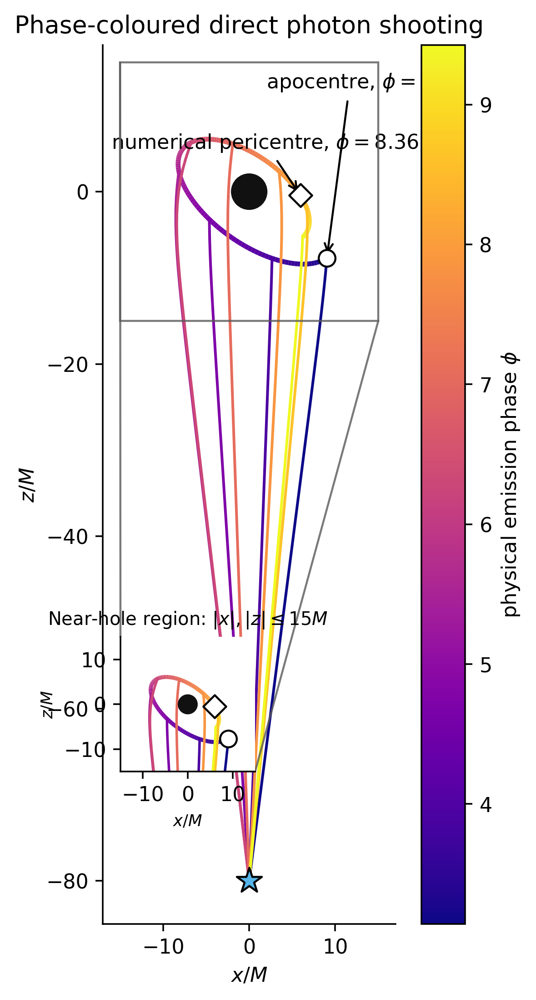

# Learning When Black-Hole Hair Is Observable

A controlled Kiselev black-hole inverse-learning benchmark for physical
identifiability, observable complementarity, distribution shift, numerical
convergence, and inverse-estimator robustness. The study combines timelike
emitter evolution, three-dimensional direct null-geodesic shooting, local and
finite-domain identifiability diagnostics, and leakage-aware inverse learning.
It uses simulated theoretical data and does not claim an observational
constraint on black-hole hair.

## Paper

- **Title:** *Learning When Black-Hole Hair Is Observable: Physical
  Identifiability, Generalization, and Observable Complementarity*
- **Author:** Ariadna Uxue Palomino Ylla
- **Status:** journal manuscript; preparing for a Physical Review D submission
- **PDF:** [`paper/current_study/manuscript/manuscript.pdf`](paper/current_study/manuscript/manuscript.pdf)
- **Source:** [`paper/current_study/manuscript/main.tex`](paper/current_study/manuscript/main.tex)

## Main scientific findings

- At exactly `k = 0`, the metric is independent of `w_q`; this is an exact
  structural non-identifiability boundary, not merely a difficult regression
  region.
- Ringdown alone leaves `w_q` comparatively difficult to recover. Redshift and
  photon geometry provide complementary parameter information.
- A restricted observation-facing sensitivity check retains only `Omega` and
  `lambda` from ringdown and signed sky coordinates `alpha` and `beta` from the
  ray calculation. Redshift and signed sky coordinates preserve the qualitative
  complementarity after latent photon-orbit quantities are removed. These sky
  coordinates remain idealized ray-level quantities, not detector observables.
- Forward-feature convergence does not guarantee robustness of frozen inverse
  estimators: tree-based tail shifts remain important under the targeted
  161-to-321-phase audit.
- Random interpolation is more optimistic than grouped physical interpolation
  and directional extrapolation.

The primary physical comparison finds a 4.54-fold increase in the grid-median
minimum singular value when photon geometry is added to ringdown. These results
apply to the predefined finite Kiselev grid and tested normalizations; they do
not establish an observational constraint or continuous global injectivity.

## Physical geodesic shooting

The physical pipeline evolves an orbiting timelike emitter and shoots direct
null geodesics to a static observer. The image below is a phase-coloured
geodesic diagnostic, not an observational image.



## Repository layout

### Current study

| Path | Purpose |
|---|---|
| `src/bhhairml/shooting/` | Timelike-emitter and Cartesian null-geodesic solvers |
| `src/bhhairml/validation/` | Physical-grid, identifiability, convergence, robustness, and ambiguity audits |
| `src/bhhairml/workflows/reproduce_current_study.py` | Lightweight reproduction of headline aggregations from tracked results |
| `configs/` | Versioned simulation and analysis settings |
| `paper/current_study/` | Current manuscript, compact data package, figures, metadata, and audit documentation |
| `artifacts/kiselev_identifiability_grid/` | Nominal 81-phase physical feature and Jacobian archive |
| `artifacts/journal_phase_convergence/` | Validated 161/321-phase representations and fixed split assignments |
| `artifacts/observation_facing_sensitivity/` | Restricted-feature Jacobian, inverse-model, nearest-model, and figure outputs |
| `scripts/observation_facing_sensitivity.py` | Deterministic observation-facing sensitivity analysis |
| `scripts/audit_observation_facing_order_provenance.py` | Row-order and split-membership provenance audit |
| `experiments/traditional_inverse_baselines/` | Non-learned nearest-model and local-Jacobian baselines |
| `audits/` | Independent physical-shooting implementation and walkthrough |

### Historical and legacy material

The repository retains the earlier dense synthetic benchmark, proxy-geodesic
experiments, conference/workshop manuscripts, poster assets, and reviewer-only
revision records. They document the development of the project but are not
substitutes for the current physical-shooting results. In particular,
`reviewer/_revision_2026_10/` is provenance material, while historical proxy
workflows remain under the older experiment, report, and paper directories.

## Reproduction

Python 3.10 is required by the pinned project metadata.

### Install

```bash
python -m pip install -e .
```

For development and tests:

```bash
python -m pip install -e ".[dev]"
```

### Reproduce headline aggregations without rerunning the physical grid

```bash
python -m bhhairml.workflows.reproduce_current_study
```

This validates the tracked machine-readable archive and rebuilds the compact
claim tables under `paper/current_study/metadata/`. It does not launch the
expensive geodesic-shooting campaign.

### Rerun the observation-facing sensitivity analysis

```bash
python scripts/observation_facing_sensitivity.py
```

This reads the tracked nominal 81-phase Jacobian features, validated 161-phase
inverse representation, and predefined splits. It regenerates
`artifacts/observation_facing_sensitivity/` without rerunning geodesics.
Physical point identifiers are sorted before row-index conversion so RF/MLP
fitting and nearest-neighbor tie handling are deterministic across Python hash
seeds.

### Build the manuscript

With [Tectonic](https://tectonic-typesetting.github.io/) installed:

```bash
cd paper/current_study/manuscript
tectonic main.tex
```

The tracked publication PDF is `paper/current_study/manuscript/manuscript.pdf`.

### Tests

```bash
python -m pytest -q
```

Focused observation-facing and provenance checks can be run with:

```bash
python -m pytest -q \
  tests/test_observation_facing_sensitivity.py \
  tests/test_observation_facing_manuscript_integration.py \
  tests/test_observation_facing_order_provenance.py
```

Full forward regeneration is intentionally separate and substantially more
expensive:

```bash
python -m bhhairml.validation.kiselev_identifiability_grid \
  --config configs/kiselev_identifiability_grid.yaml
```

## Data and reproducibility

- All study data are simulated theoretical data; no observational data are
  used in the current identifiability analysis.
- Machine-readable derived results, the 115 predefined split specifications,
  and canonical source-file SHA256 hashes are tracked in the repository.
- The Jacobian analysis uses the nominal 81-phase archive; inverse-learning
  sensitivity tests use the separately validated 161-phase representation.
- The public tables reproduce the reported headline aggregations without
  rerunning the full physical grid.
- Full bitwise replay of the frozen 321-phase prediction audit additionally
  requires 5,520 serialized estimators (approximately 822 MB). They are not in
  Git and are available from the author upon reasonable request.
- No Zenodo DOI has been minted yet.

## Citation

Please use [`CITATION.cff`](CITATION.cff) for the software/repository citation.
The related published ringdown framework is:

> A. U. Palomino Ylla *et al.*, "Ringdown waves from hairy black holes,"
> *Journal of Cosmology and Astroparticle Physics* **2026**(09), 046 (2026),
> <https://doi.org/10.1088/1475-7516/2026/09/046>.

## License

Released under the [MIT License](LICENSE).
