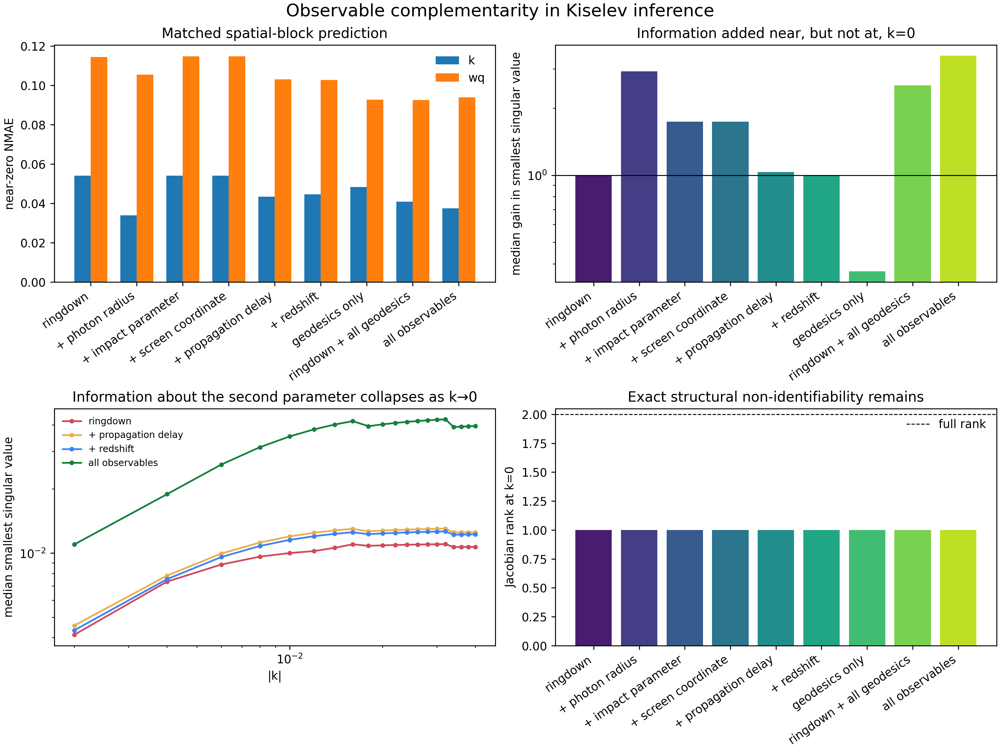

# Observable complementarity near the Kiselev degeneracy

## Question

Which additional observables supply genuinely independent information about the
Kiselev parameters near `k=0`, and can any of them remove the exact degeneracy?

For a metric observable `O(k,wq)`, the Kiselev contribution disappears at `k=0`.
Consequently,

```text
dO/dwq |_(k=0) = 0,
```

so the observable Jacobian has rank at most one there. This is structural
non-identifiability: no regression model can infer a parameter that has no effect on
the supplied observables.

## Matched protocol

- Generate a 41 × 41 grid, including `k=0`, over `k ∈ [-0.04, 0.04]` and
  `wq ∈ [-1.4, 1.4]`.
- Use the same five spatial-block folds and the same Extra Trees configuration for
  every feature set.
- Compare ringdown `(Omega, lambda)` with the photon-radius shift and each synthetic
  geodesic proxy separately, geodesics alone, all geodesics, and all observables.
- Measure grouped-CV NMAE and a domain-standardized Jacobian's smallest singular
  value, condition number, information determinant, and rank.
- Define the near-zero region as `|k| <= 0.01`, excluding `k=0` when calculating
  finite information gains.



## Results

All observables improve near-zero recovery relative to ringdown alone, but the gains
are modest because information about `wq` is already collapsing. Near-zero `wq` NMAE
falls from `0.1144 ± 0.0819` with ringdown to `0.0940 ± 0.0736` with all observables.
Near-zero `k` NMAE falls from `0.0541 ± 0.0714` to `0.0375 ± 0.0231`.

| Feature set | Near-zero NMAE(k) | Near-zero NMAE(wq) | Median sigma-min gain |
|---|---:|---:|---:|
| Ringdown | 0.0541 | 0.1144 | 1.00× |
| + photon radius | 0.0340 | 0.1054 | 2.96× |
| + impact parameter | 0.0541 | 0.1148 | 1.74× |
| + screen coordinate | 0.0541 | 0.1148 | 1.74× |
| + propagation delay | 0.0433 | 0.1031 | 1.04× |
| + redshift | 0.0447 | 0.1027 | 1.00× |
| Ringdown + all geodesics | 0.0408 | 0.0926 | 2.56× |
| All observables | 0.0375 | 0.0940 | 3.51× |

The photon-radius shift supplies the strongest single local Jacobian gain. Combining
the geodesic proxies gives a larger improvement than any one proxy, and including the
photon radius produces the largest information gain. Predictive and local-Jacobian
rankings need not be identical: tree models exploit nonlinear information across a
finite held-out block, whereas the Jacobian measures infinitesimal local sensitivity.

The direct-branch screen-coordinate proxy is proportional to the impact-parameter
proxy in the current implementation, so their identical results correctly expose a
redundant observable rather than independent information.

## Exact result at k=0

Every tested feature set has median smallest singular value zero and Jacobian rank
one at `k=0`. Additional observables improve conditioning near the degeneracy but do
not and cannot restore the missing `wq` direction at the exact limit.

The defensible conclusion is therefore:

> Observable complementarity expands the practically identifiable region, but it
> cannot remove a structural parameter degeneracy where the parameter ceases to
> affect the physical model.

## Limitations

- The geodesic quantities are smooth synthetic proxies, not outputs from physical
  null-ray shooting or detector measurements.
- The screen-coordinate proxy is intentionally simple and redundant on the direct
  branch.
- Results use noiseless simulations and domain-variance standardization. A subsequent
  measurement study must whiten the Jacobian by realistic observable uncertainties.
- The comparison concerns the static Kiselev model on the stated parameter domain;
  it should not be generalized automatically to other metrics.

## Reproduce

```bash
PYTHONPATH=src python -m bhhairml.experiments.observable_complementarity
```

Generated tables and PNG/PDF figures are written to
`artifacts/observable_complementarity/`.
